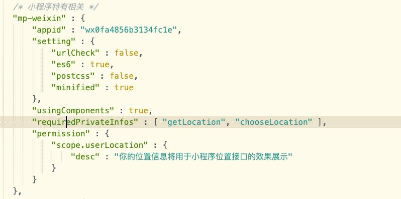

### liu-chooseAddress 适用于uni-app项目的仿美团新增地址选择模版
### 本组件目前兼容微信小程序、H5,完美仿照美团新增地址选择
### 本组件支持微信小程序、H5打开地图选择位置并修改完善地址等
# --- 扫码预览、关注我们 ---

## 扫码关注公众号，查看更多插件信息，预览插件效果！ 


### 引入插件后 
#### H5需要先在manifest.json 中web配置中添加腾讯地图key值
#### 小程序需先在manifest.json 中配置位置接口权限以及源码中添加"requiredPrivateInfos" : [ "getLocation", "chooseLocation" ]同时上线前需在[微信公众平台](https://mp.weixin.qq.com/)开发管理-接口设置开通相关api接口 

### 使用示例
``` 
<template>
	<view class="page-main">
		<liu-chooseAddress ref="liuChooseAddress" @submit="submitAddress" @detele="deteleAddress">
		</liu-chooseAddress>
	</view>
</template>

<script>
	export default {
		data() {
			return {
				// 'RBWBZ-CV5RW-VX7RW-36ZQL-YZVYF-DDBMM' 此处为作者为方便H5体验所留测试用key,可以用来体验，但请勿在项目内直接使用
			}
		},
		methods: {
			//添加地址成功回调
			submitAddress(e) {
				console.log('添加调地址信息：', e)
			},
			//删除地址回调
			deteleAddress(e) {
				console.log('所删除的地址信息：', e)
			},
			// 地址回显(编辑)调用此方法
			editAddress() {
				let obj = {
					id: '1',
					detailAddress: '', //门牌号(详细地址)
					userName: '', //联系人姓名
					userPhone: '', //手机号
					lableName: '', //标签
					sexType: '', //性别
					title: '', //地址概述
					address: '', //详细地址
					longitude: '', //经度
					latitude: '', //纬度
					agreeState: '', //是否是默认地址
				}
				this.$refs.liuChooseAddress.setData(obj)
			}
		}
	}
</script>

<style lang="scss" scoped>
	.page-main {
		width: 100%;
		height: 100vh;
	}
</style>
```

### 属性说明
| 名称                         | 类型           | 默认值                  | 描述            |
| ----------------------------|--------------- | ---------------------- | ---------------|
| @submit                     | Function         |                     | 添加地址成功回调事件
| @detele                     | Function         |                     | 删除地址回调事件
